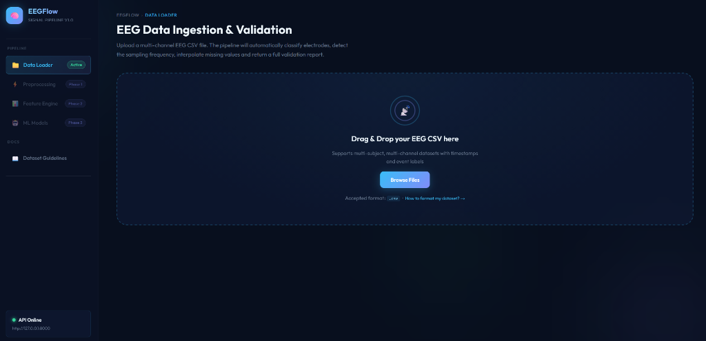
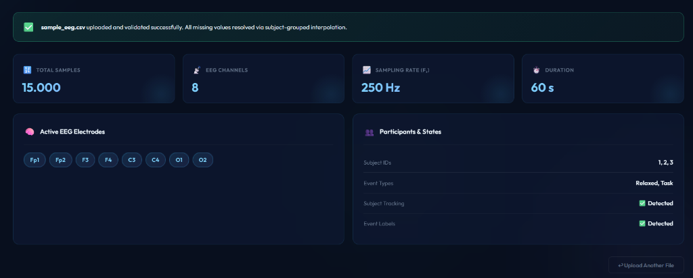
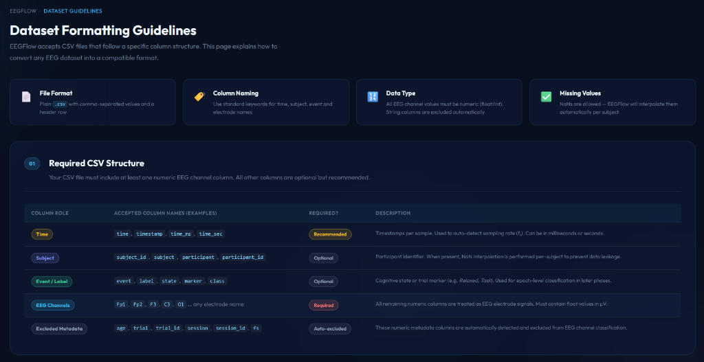
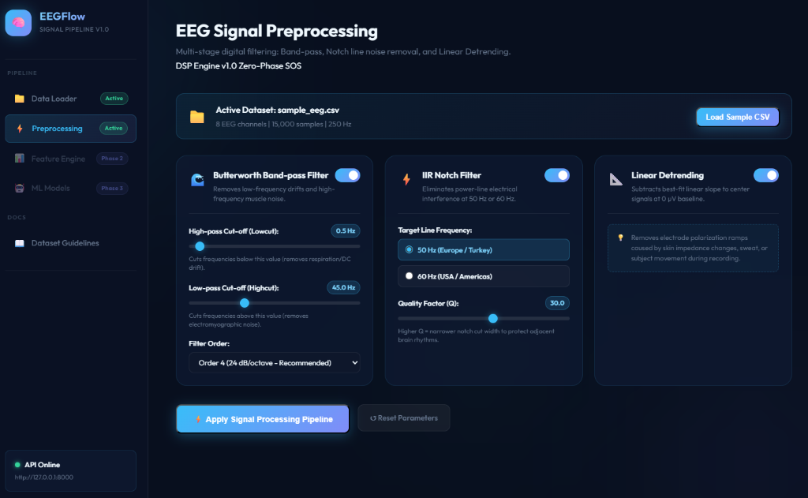
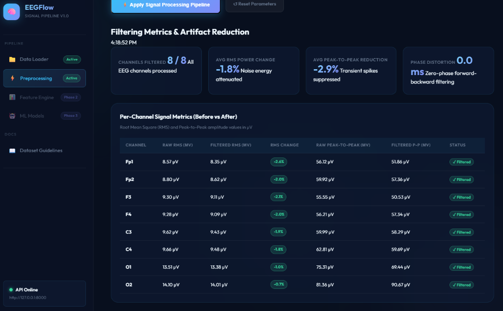
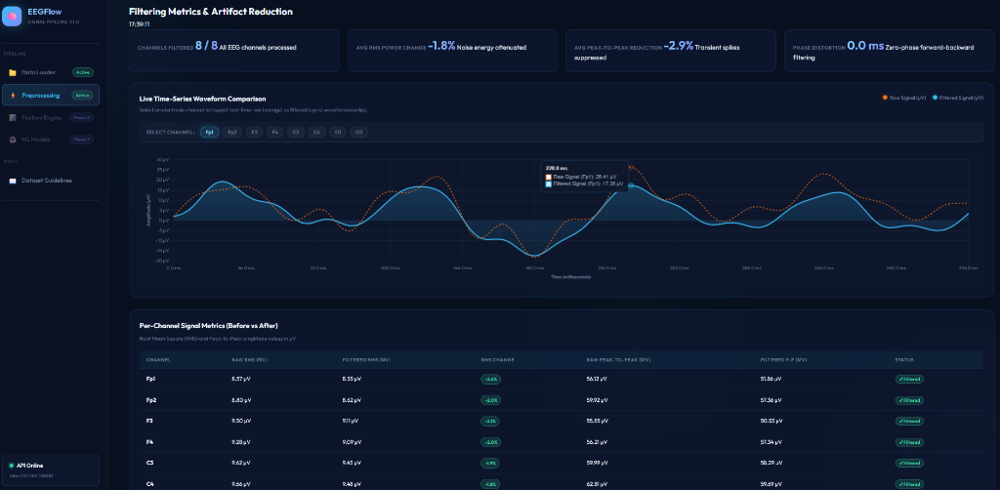

# EEGFlow

EEG Sinyal İşleme ve Makine Öğrenmesi Sınıflandırma Kontrol Paneli

### 📸 Ekran Görüntüleri
| Dosya Yükleme Paneli | Doğrulama & Metrik Sonuçları | Dataset Formatlama Rehberi |
| :---: | :---: | :---: |
|  |  |  |

| Ön İşleme Kontrol Paneli (DSP Filtreler) | Filtreleme Metrikleri & Sinyal Analizi |
| :---: | :---: |
|  |  |

| Canlı Sinyal Dalga Grafiği (Chart.js Raw vs Filtered) |
| :---: |
|  |

## Proje Hakkında
EEGFlow; çok kanallı EEG (Elektroensefalografi) verilerini gürültülerden arındırmak (filtrelemek), zaman pencerelerine (epoch) bölmek, öznitelik (feature) çıkarımı yapmak ve klasik makine öğrenmesi modelleriyle sınıflandırmak amacıyla geliştirilmiş modüler bir web uygulamasıdır. 

Uygulama, EEG sinyallerinin hassas yapısına uygun olarak **katılımcı bazlı veri bölme (Group K-Fold)** yöntemiyle çalışarak makine öğrenmesinde sıkça karşılaşılan "veri sızıntısı" (data leakage) sorununu engeller.

## Temel Özellikler
* **Veri Yükleme ve Doğrulama:** Çok kanallı EEG CSV dosyalarının yüklenmesi ve otomatik örnekleme frekansı ($f_s$) tespiti.
* **Modüler Sinyal Filtreleme:** Butterworth band-pass filtre, Notch filtre (50Hz/60Hz) ve lineer detrending baseline düzeltmesi.
* **Çok Kanallı Görselleştirme:** Ham ve filtrelenmiş sinyallerin tarayıcıda pürüzsüz çizimi.
* **Öznitelik Mühendisliği:** Zaman alanı (istatistiksel, Hjorth) ve frekans alanı (PSD bant güçleri, Spektrogram) özellik çıkarımı.
* **Makine Öğrenmesi & Doğrulama:** SVM, Random Forest ve XGBoost modellerinin denek bazlı Group K-Fold ile sızıntısız eğitilmesi ve karşılaştırılması.

## Geliştirme Fazları ve Kilometre Taşları
Proje, danışman hocalarımızın geri bildirimleri doğrultusunda 3 ana faza ayrılmıştır:
1. **Faz 1 - Pipeline Tasarımı (Gün 1-10):** Ham Veri ➔ Temiz Sinyal ➔ Görselleştirme akışının kurulması.
2. **Faz 2 - Öznitelik Mühendisliği (Gün 11-15):** Zaman Pencereleri (Epoching) ➔ PSD Bant Güçleri ➔ Alpha Dalgaları Fizyolojik Doğrulaması.
3. **Faz 3 - Model ve Doğrulama (Gün 16-20):** SVM/RF/XGBoost Modelleri ➔ Group K-Fold Çapraz Doğrulama ➔ Metrik Dashboard.

Detaylı teknik plan için [implementation_plan.md](implementation_plan.md) dosyasını inceleyebilirsiniz.

## Kurulum ve Çalıştırma
*Detaylı kurulum adımları ve kullanım rehberi Faz 1 sonrasında eklenecektir.*
