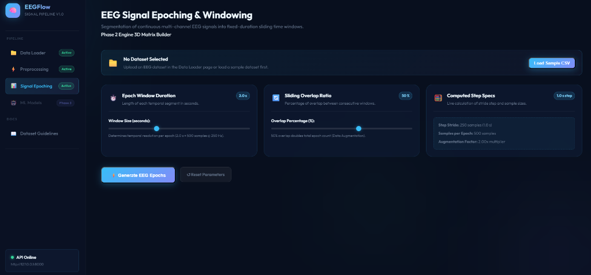
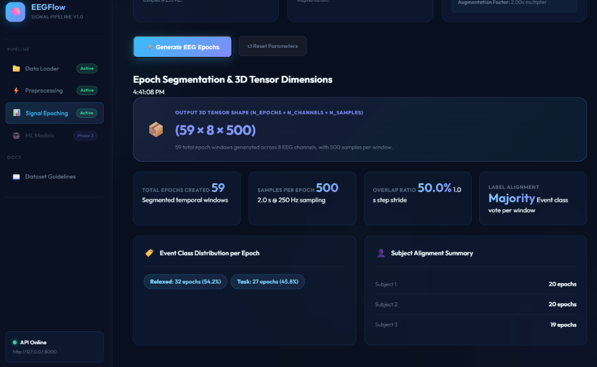

# EEGFlow

EEG Sinyal İşleme ve Makine Öğrenmesi Sınıflandırma Kontrol Paneli


### 📸 Ekran Görüntüleri

| Dosya Yükleme Paneli | Doğrulama & Metrik Sonuçları | Dataset Formatlama Rehberi |
| :---: | :---: | :---: |
|  |  |  |

| Ön İşleme Kontrol Paneli (DSP Filtreler) | Filtreleme Metrikleri & Sinyal Analizi |
| :---: | :---: |
|  |  |

| Canlı Sinyal Dalga Grafiği (Chart.js Raw vs Filtered) |
| :---: |
|  |

| Signal Epoching Kontrol Paneli (Sliding Window) | 3D Tensor Matrisi & Etiket Dağılımı |
| :---: | :---: |
|  |  |

| 🤖 ML Model Eğitim Paneli & Metrikler | 📊 Group K-Fold Cross-Validation Sonuçları |
| :---: | :---: |
|  |  |

---

## Proje Hakkında
EEGFlow; çok kanallı EEG (Elektroensefalografi) verilerini gürültülerden arındırmak (filtrelemek), zaman pencerelerine (epoch) bölmek, öznitelik (feature) çıkarımı yapmak ve klasik makine öğrenmesi modelleriyle sınıflandırmak amacıyla geliştirilmiş modüler bir web uygulamasıdır.

Uygulama, EEG sinyallerinin hassas yapısına uygun olarak **katılımcı bazlı veri bölme (Group K-Fold)** yöntemiyle çalışarak makine öğrenmesinde sıkça karşılaşılan "veri sızıntısı" (data leakage) sorununu engeller.

## Temel Özellikler
* **Veri Yükleme ve Doğrulama:** Çok kanallı EEG CSV dosyalarının yüklenmesi ve otomatik örnekleme frekansı ($f_s$) tespiti.
* **Modüler Sinyal Filtreleme:** Butterworth band-pass filtre, Notch filtre (50Hz/60Hz) ve lineer detrending baseline düzeltmesi.
* **Çok Kanallı Görselleştirme:** Ham ve filtrelenmiş sinyallerin tarayıcıda pürüzsüz çizimi.
* **Öznitelik Mühendisliği:** Zaman alanı (istatistiksel, Hjorth) ve frekans alanı (PSD bant güçleri, Spektrogram) özellik çıkarımı.
* **Makine Öğrenmesi & Doğrulama:** SVM, Random Forest ve XGBoost modellerinin denek bazlı Group K-Fold ile sızıntısız eğitilmesi ve karşılaştırılması.

## Proje Dizin Yapısı
```text
eeg_internship_project/
├── backend/
│   ├── main.py                 # FastAPI Web Sunucusu ve Endpoints
│   ├── utils/
│   │   ├── data_loader.py      # EEG Veri Yükleme ve Validasyon Modülü
│   │   ├── filters.py          # Dijital Sinyal İşleme (DSP) Filtreleri
│   │   ├── epoching.py         # EEG Sliding Window Dilimleme Modülü
│   │   ├── features.py         # Zaman ve Frekans Alanı Özellik Çıkarıcı
│   │   └── models.py           # SVM, RF, XGBoost ve GroupKFold Modelleri
│   └── requirements.txt        # Python Bağımlılıkları
├── frontend/
│   ├── index.html              # Tek Sayfa Uygulama (SPA) Arayüzü
│   ├── style.css               # Glassmorphism Modern UI Tasarım Teması
│   └── app.js                  # Frontend Arayüz Yönetimi ve API İletişimi
├── tests/
│   ├── test_data_loader.py     # Veri Yükleyici Birim Testleri
│   ├── test_filters.py         # Filtre Birim Testleri
│   ├── test_epoching.py        # Epoching Birim Testleri
│   ├── test_features.py        # Feature Extraction Birim Testleri
│   ├── test_models.py          # ML Modelleri Birim Testleri
│   ├── test_upload_api.py      # Upload API Entegrasyon Testleri
│   ├── test_filter_api.py      # Filter API Entegrasyon Testleri
│   ├── test_epoch_api.py       # Epoch API Entegrasyon Testleri
│   ├── test_feature_api.py     # Feature API Entegrasyon Testleri
│   └── test_model_api.py       # ML API Entegrasyon Testleri
└── README.md                   # Proje Genel Dokümantasyonu
```

## Teknolojik Altyapı
* **Backend:** FastAPI, Uvicorn, NumPy, Pandas, SciPy, Scikit-learn, XGBoost
* **Frontend:** Vanilla HTML5, Vanilla CSS3 (Custom Variables, CSS Grid/Flexbox), Vanilla JavaScript (ES6), Chart.js v4
* **Test ve Kalite:** Pytest, HTTPX (TestClient)

## Geliştirme Fazları ve Kilometre Taşları
Proje, danışman hocalarımızın geri bildirimleri doğrultusunda 3 ana faza ayrılmıştır:
1. **Faz 1 - Pipeline Tasarımı (Gün 1-10):** Ham Veri ➔ Temiz Sinyal ➔ Görselleştirme akışının kurulması.
2. **Faz 2 - Öznitelik Mühendisliği (Gün 11-15):** Zaman Pencereleri (Epoching) ➔ PSD Bant Güçleri ➔ Alpha Dalgaları Fizyolojik Doğrulaması.
3. **Faz 3 - Model ve Doğrulama (Gün 16-20):** SVM/RF/XGBoost Modelleri ➔ Group K-Fold Çapraz Doğrulama ➔ Metrik Dashboard.

## Kurulum ve Çalıştırma

### 1. Gereksinimler
Sisteminizde **Python 3.8+** kurulu olmalıdır.

### 2. Kurulum
Projeyi klonladıktan veya indirdikten sonra, proje ana dizininde bir sanal ortam oluşturup bağımlılıkları yükleyin:

```bash
# Sanal ortam oluşturma
python -m venv venv

# Sanal ortamı aktifleştirme (Windows)
.\venv\Scripts\activate

# Bağımlılıkları yükleme
pip install -r backend/requirements.txt
```

### 3. Backend Sunucusunu Başlatma
Sanal ortamınız aktifken uvicorn sunucusunu çalıştırın:

```bash
uvicorn backend.main:app --host 127.0.0.1 --port 8000 --reload
```

Sunucu başarıyla başladığında tarayıcınızdan **[http://127.0.0.1:8000](http://127.0.0.1:8000)** adresine giderek EEGFlow arayüzüne erişebilirsiniz.

### 4. Testleri Koşturma
Tüm test suitini (108 test) çalıştırmak için:

```bash
# Windows PowerShell
$env:PYTHONPATH="."; pytest

# Linux / macOS
PYTHONPATH=. pytest
```

## API Dokümantasyonu
API çalışır durumdayken **[http://127.0.0.1:8000/docs](http://127.0.0.1:8000/docs)** adresinden interaktif Swagger dokümantasyonuna erişebilirsiniz.

| Endpoint | Metod | Açıklama |
| --- | --- | --- |
| `/api/upload` | POST | EEG CSV dosyası yükler ve veri kalitesini denetler |
| `/api/filter` | POST | Butterworth, Notch ve Detrend filtrelerini uygular |
| `/api/epoch` | POST | Sinyali sliding window ile zaman pencerelerine böler |
| `/api/extract-features` | POST | Epoch'lardan 144 boyutlu özellik vektörü çıkarır |
| `/api/train-model` | POST | SVM/RF/XGBoost modelini eğitir ve test metriklerini döner |
| `/api/cross-validate` | POST | Group K-Fold çapraz doğrulama yapar |
